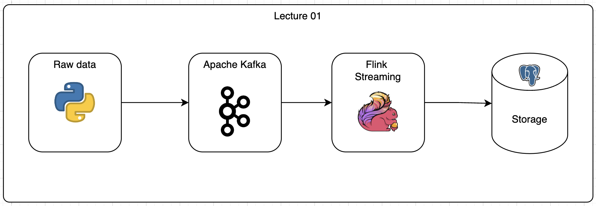
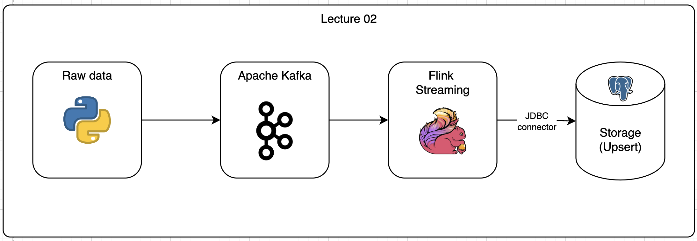

# Learn Apache Flink from scratch    

This project is a data pipeline that reads data from a Kafka topic, processes it using Flink, and writes the results to a PostgreSQL database.

## Pre-requisites

- Docker
- Docker Compose
- Python 3.8
- Pipenv 

Run docker compose to start Kafka, Flink, and PostgreSQL services for init resource

```bash
docker-compose up -d

pip install -r requirement-dev.txt
```

## Lecture 1: Job read data from Kafka and write to PostgreSQL

### Architecture - Data flow 



### Model 

The `Stock` class in `app/model/stock.py` represents a stock with attributes `event_time`, `ticker`, and `price`. It also includes methods to create a dictionary representation of the object and to generate random stock data.

### Kafka Configuration 

The Kafka configuration in `app/utils/kafka_config.py` includes the bootstrap servers, group id, startup mode, and topic name for the Kafka consumer.

### Database Configuration 
The Database configuration in `app/utils/db_config.py` includes the database URL, username, password, and table name for the PostgreSQL database.

### Flink Job 

The Flink job in `app/flink_jobs/kafka_to_postgres_data_pipeline.py` sets up the environment, creates a Kafka source table and a PostgreSQL sink table, and executes a SQL query to transfer data from the source to the sink.

### Sample data

The sample data in `app/batch_job/app_stock_to_kafka_data_pipeline.py` includes a list of stock data with event time, ticker, and price. It will be written to the Kafka topic by the producer.

## Usage

Run the Flink job to start the data pipeline. The job will continuously read new data from the Kafka topic, process it, and write the results to the PostgreSQL database.
```bash
python -m app.batch_job.app_stock_to_kafka_data_pipeline

## Generate demo data

Run the Flink job to start the data pipeline. The job will continuously read new data from the Kafka topic, process it, and write the results to the PostgreSQL database.

```bash
python -m app.flink_jobs.kafka_to_postgres_data_pipeline_lecture
```


# Lecture 2: Job read data from Kafka, process it using Flink, and UPSERT to PostgreSQL    

This lecture focuses on a data pipeline that reads data from a Kafka topic, processes it using Flink, and writes the results to a PostgreSQL database. Using JDBC connector

## Architecture - Data flow



### Model 

The `Stock` class in `app/model/stock.py` represents a stock with attributes `ticker`, `price`, `volume`, `open_price`, `high`, `low`, `close_price`, and `adjusted_close`. It also includes methods to create a dictionary representation of the object and to generate random stock data.

### Kafka Configuration 

The Kafka configuration in `app/utils/kafka_config.py` includes the bootstrap servers, group id, startup mode, and topic name for the Kafka consumer.

### Database Configuration 

The Database configuration in `app/utils/db_config.py` includes the database URL, username, password, and table name for the PostgreSQL database.


### Flink Function 

The `flink_function.py` file contains the `PostgresUpsertSinkFunction` class, which is a custom sink function for writing data to a PostgreSQL database.

This class extends the `JdbcSink` class from PyFlink and overrides the `transform_row` method to convert the incoming data into a format suitable for insertion into the PostgreSQL database.

The `transform_row` method takes a `Row` object as input, which represents a row of data from the Kafka source stream. It returns a new `Row` object with the same data, but with the fields rearranged and named according to the PostgreSQL table schema.

The `invoke` method of the `PostgresUpsertSinkFunction` class sets up the JDBC sink with the appropriate SQL query for upserting data into the PostgreSQL database. It uses the `JdbcSink.sink` method from PyFlink to create the sink.


### Flink Job 

The Flink job in `app/flink_jobs/kafka_to_postgres_data_pipeline_lecture02.py` sets up the environment, creates a Kafka source table and a PostgreSQL sink table, and executes a SQL query to transfer data from the source to the sink.

### Sample data

The sample data in `app/batch_job/app_stock_to_kafka_data_pipeline.py` includes a list of stock data with event time, ticker, and price. It will be written to the Kafka topic by the producer.

## Usage

Run the Flink job to start the data pipeline. The job will continuously read new data from the Kafka topic, process it, and write the results to the PostgreSQL database.
```bash
python -m app.batch_job.app_stock_to_kafka_data_pipeline

## Generate demo data

Run the Flink job to start the data pipeline. The job will continuously read new data from the Kafka topic, process it, and write the results to the PostgreSQL database.

```bash
python -m app.flink_jobs.kafka_to_postgres_data_pipeline_lecture02
```

## Interfaces

- Kafka Client: http://localhost:8080/ui/clusters/local/all-topics
- PostgreSQL Admin: http://localhost:5050/browser/
